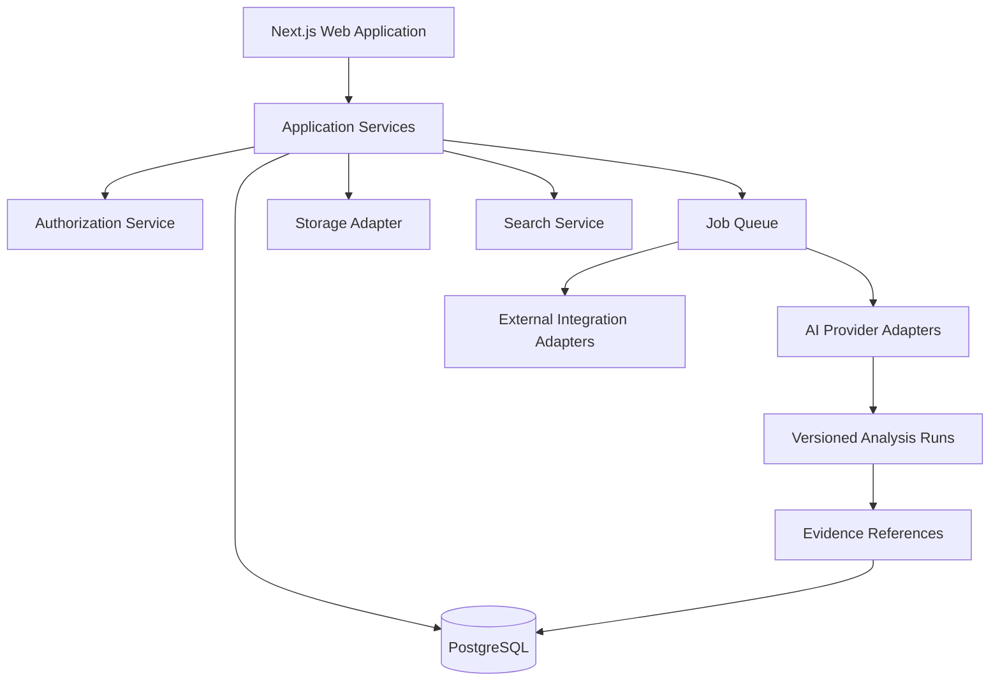

# Reference Architecture

## Dependency rule
Domain modules do not import provider SDKs. Adapters implement contracts owned by the application or domain boundary. UI code does not perform authorization decisions.

## Initial deployment
A modular monolith is preferred for the MVP: one Next.js application, one worker process, PostgreSQL, object storage, and a queue. Extract services only after measured pressure.
